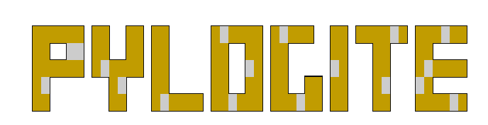

# PyloGite - Metamorphic Code Generator &amp; Loader

# What is it?

Pylogite is a metamorphic code generator. The tool's aim is to take a Position independent shellcode obfuscate it by changing/deleting/adding x86 instructions and inject it into the given benign PE file. Every generated sample will be different from the last one.

# What can it do?

| Feature  | :heavy_check_mark: / TODO |
| ------------- | ------------- |
| Insert garbage instructions  | :heavy_check_mark: |
| Obfuscate relative branch instructions  | :heavy_check_mark:  |
| Graph view destruction | :heavy_check_mark: |
| Obfuscate mov instructions  | :heavy_check_mark:  |
| Unsafe registry arithmetics | :heavy_check_mark: |
| Obfuscate push/pop instructions | :heavy_check_mark: |
| Obfuscate cmp instructions | TODO |
| Add SSE instructions | TODO |
| Control Flow Deception | TODO |

# How?

The program takes a Position independent shellcode (must not have anything in .data/.rdata section) and obfuscates it by changing already existing instructions with new x86 instructions which perform the same action but are different in size. Program can also insert garbage instructions consisting of branches, calls, unsafe registry arithmetics anywhere in the code Hopefully achieving metamorphism.

Currently static immediate values that are being moved with `mov` instructions are obfuscated to hide signature values. Later on immediate values that are being used in `cmp`, `push`, `add` and `sub` instructions will also be obfuscated.

